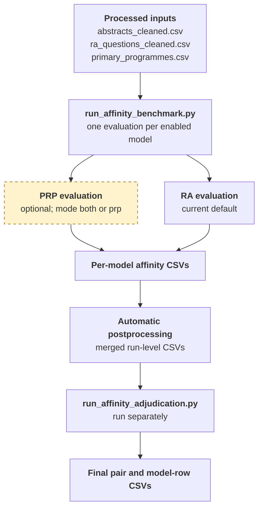

<p align="center">
  
</p>

# IEEE Classifier

Project to classify IEEE abstracts against Research Agenda (RA) questions using embeddings and LLM reasoning.

## Data Management

The active raw-to-processed data lineage, result lifecycle, and sharing guidance
are documented in [Data Management and Lineage](docs/data-management.md).

Large generated result artifacts are versioned with DVC and stored in the
private Google Drive remote. See [DVC and Google Drive Setup](docs/dvc-setup.md)
for installation, authentication, push/pull, and troubleshooting instructions.

## Setup

See the [Setup Guide](docs/setup.md) for Python dependencies, enabled-model
credentials, Ollama configuration, backend selection, and optional GPU details.

## Running Scripts

Run commands from the repository root. The scripts use paths like `data/processed` and imports from `src`.

### Basic Benchmark and Adjudication Workflow

The standard pipeline creates per-model affinities, combines them into
run-level CSVs, then adjudicates pairs where model agreement is below the
configured thresholds.



All artifacts for a run are connected by the same `<run_id>` directory under
`data/results/affinity_benchmark/`. The benchmark reads processed inputs from
`data/processed/`: cleaned abstracts for every run, RA questions for RA scoring,
and primary programmes for PRP scoring. Generate or retrieve these inputs
before running the pipeline; see [Data Management](docs/data-management.md).

The benchmark launches `run_affinity_evaluation.py` once per enabled model
profile and postprocesses the model outputs. It does not run adjudication;
launch adjudication separately after the benchmark. PRP scoring is available
but is not part of the current default `mode: ra`. See the [Affinity Evaluation
guide](docs/affinity-evaluation.md) and [Affinity Adjudication
guide](docs/affinity-adjudication.md) for details.

### Run Multi-Model Affinity Benchmark

Enabled model profiles and benchmark model-list overrides are covered in the
[Affinity Evaluation guide](docs/affinity-evaluation.md).

Run affinity evaluation for each enabled model profile. This example includes
the optional PRP stage, then uses its results to route RA candidates. Each model
writes to its own run subdirectory.

```bash
python scripts/run_affinity_benchmark.py \
  --mode both \
  --ra-retrieval-mode prp_only \
  --run-id example_run
```

The benchmark writes per-model results under
`data/results/affinity_benchmark/<run_id>/` and automatically merges them.
To rebuild merged files for an existing run:

```bash
python scripts/run_postprocessing_affinity_benchmark.py \
  --input-root data/results/affinity_benchmark \
  --run-id example_run
```

For benchmark inputs, result details, and retrieval options, see the
[Affinity Evaluation guide](docs/affinity-evaluation.md).

### Adjudicate Affinity Disagreements

Run adjudication after the benchmark has merged its outputs. This example
processes RA and PRP and raises the thresholds to select disagreements for LLM
review; see the guide for the current defaults and threshold behavior.

```bash
python scripts/run_affinity_adjudication.py \
  --input-root data/results/affinity_benchmark \
  --run-id example_run \
  --mode both \
  --min-agreement 0.8 \
  --min-agreement-mean 0.8
```

Use `--mode ra` or `--mode prp` for one stage. Add `--dry-run` to preview
selected-pair counts. See the [Affinity Adjudication guide](docs/affinity-adjudication.md)
for thresholds, inputs, outputs, and other options.

### Run Benchmark Slices From a Manifest

Use the manifest runner to execute independent benchmark slices concurrently.

Manifest schema (CSV header):
- `run_id,enabled,year_start,year_end,journals,output_tag,notes`

Example manifest already prepared for TPWRS by year (2010 to 2026):
- `data/processed/manifest_tpwrs_2010_2026_by_year.csv`

Dry run (print commands only):

```bash
python scripts/run_affinity_benchmark_parallel_manifest.py \
  --manifest data/processed/manifest_tpwrs_2010_2026_by_year.csv \
  --mode ra \
  --dry-run
```

Execute all enabled rows:

```bash
python scripts/run_affinity_benchmark_parallel_manifest.py \
  --manifest data/processed/manifest_tpwrs_2010_2026_by_year.csv \
  --mode ra
```

Each enabled row forwards `year_start`, `year_end`, and `journals` to
`scripts/run_affinity_benchmark_parallel.py`, which then forwards those flags
to grouped child runs in `scripts/run_affinity_benchmark.py`. Each row gets its
own run directory under the output root, and each benchmark run postprocesses
its outputs automatically. Use `--continue-on-error` to proceed if one slice
fails.

### Run Parallel Benchmark Launcher

Use the launcher when benchmark models are split into independent execution groups.
Models in the same `execution_group` run sequentially inside one benchmark
process; different groups run concurrently. Configure groups in
`models.llm.benchmark.models` in `src/config/settings.yaml`. Keep models that
share a constrained resource, such as one GPU, in the same group.

Usage guidelines:
- Keep models that share one GPU or one constrained backend in the same group.
- Use a logical group name such as `cloud` or `local-gpu`.
- Prefer this launcher when you want parallelism without making the benchmark
script itself more complex.

Examples:

```bash
python scripts/run_affinity_benchmark_parallel.py --dry-run
python scripts/run_affinity_benchmark_parallel.py --spawn-dry-run
python scripts/run_affinity_benchmark_parallel.py \
  --run-id example_parallel \
  --mode both \
  --ra-retrieval-mode prp_only
```

The launcher forwards regular benchmark options such as `--mode`,
`--ra-retrieval-mode`, `--year-start`, `--year-end`, and `--journals` to
`run_affinity_benchmark.py`. `--dry-run` prints the planned group layout;
`--spawn-dry-run` also starts child processes with the benchmark's dry-run
flag. A real run stages each group separately. After all groups complete, it
collects model outputs into the outer run directory and postprocesses the
combined outputs once.

Final per-model outputs are flattened into
`data/results/affinity_benchmark/<run_id>/`. Group-level metadata files are
kept with group-specific prefixes so they do not overwrite each other. The
launcher produces the same merged CSVs as the sequential benchmark workflow.

### Standalone Affinity Evaluation

For one direct RA evaluation using cosine retrieval:

```bash
python scripts/run_affinity_evaluation.py \
  --mode ra \
  --ra-retrieval-mode cosine
```

For PRP routing, retrieval modes, inputs, outputs, and standalone `prp` or
`both` runs, see the [Affinity Evaluation guide](docs/affinity-evaluation.md).

### Few-shot Prompting and Affinity Calibration

Few-shot examples are shared by affinity evaluation and adjudication. Current
settings enable them and use score-scale version 2. See the [Few-Shot Prompting
and Affinity Scoring Scale guide](docs/few-shot-affinity-calibration.md) for
configuration, YAML format, overrides, and the active scoring scale.

### Optional One-Shot Workbook Utilities

These are manual data-preparation tools, not steps in the benchmark,
evaluation, postprocessing, or adjudication workflow. Run them only when you
need to import reviewed examples or create a calibration export.

#### Import RA Few-Shot Examples

[Build RA Few-Shot Examples From Excel](docs/one-shot-few-shot-examples.md)
documents inputs, score mapping, dry-run, and append commands.

#### Export a Calibration CSV

[Build a Calibration CSV From Excel](docs/one-shot-calibration-file.md)
documents workbook selection, filtering, output schema, and dry-run/write
commands.

## Notes

- If an API backend is not configured, LLM-based scripts will fail before classification/affinity steps.
