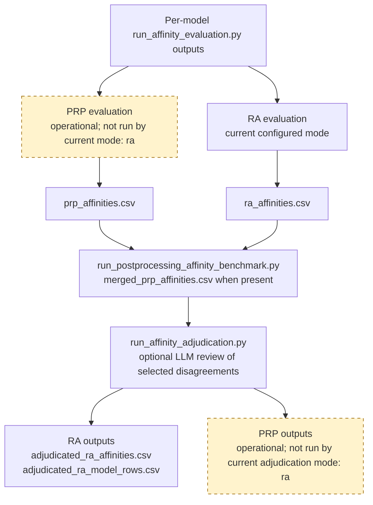

# Affinity Adjudication

Affinity adjudication combines the per-model Primary Research Programme (PRP)
or Research Agenda (RA) affinity scores in one benchmark run into a final
score for each abstract and target. It can use an LLM to review pairs where
model affinity levels disagree, while retaining the model-level evidence and
agreement statistics for analysis.

## Current Configuration

Current benchmark and adjudication settings are:

```yaml
runtime:
   affinity:
      mode: ra
      adjudication:
         mode: ra
         input_root: data/results/affinity_benchmark
         prp_input_file: merged_prp_affinities.csv
         ra_input_file: merged_ra_affinities.csv
         prp_output_file: adjudicated_prp_affinities.csv
         prp_output_model_rows_file: adjudicated_prp_model_rows.csv
         ra_output_file: adjudicated_ra_affinities.csv
         ra_output_model_rows_file: adjudicated_ra_model_rows.csv
         min_agreement: 0.0
         min_agreement_mean: 0.0
         first_n_abstracts: null
```

These are excerpts from `runtime.affinity` in `src/config/settings.yaml`;
command-line options override them for an individual run.

> **Important:** Agreement ratios cannot be negative, so the current zero
> thresholds select no pairs for LLM review. Final scores therefore fall back
> to the benchmark models' arithmetic mean (`Final_Method: ensemble_mean`).
> Selecting `mode: ra` or `mode: both` does not, by itself, enable LLM review.

## Where It Fits

Benchmark stage selection and adjudication stage selection are independent.
Under the current RA-only defaults, PRP scoring and PRP adjudication are
operational but not run. Set the benchmark and adjudication modes to `prp` or
`both` to include those stages. The benchmark and adjudicator are separate:

1. `scripts/run_affinity_benchmark.py` launches
   `scripts/run_affinity_evaluation.py` once per enabled model profile. For
   `--mode both`, each model run calculates PRP affinities and then RA
   affinities using the selected RA retrieval mode.
2. The benchmark automatically invokes
   `scripts/run_postprocessing_affinity_benchmark.py` after its model runs.
   That step merges available per-model CSVs into run-level CSVs.
3. Run `scripts/run_affinity_adjudication.py` separately to combine scores and
   optionally ask the adjudicator model to resolve disagreements.

All stages use the same run directory:
`data/results/affinity_benchmark/<run_id>/`.



The benchmark launches one `run_affinity_evaluation.py` process per enabled model; postprocessing then
combines those model results. Adjudication is an explicit follow-up so you can
choose its mode and disagreement thresholds.

## What It Does

The adjudicator uses six-band scoring from
`src/analysis/affinity_levels.py`. Adjudication handles PRP affinities, RA
affinities, or both. For each abstract/target pair, it:

1. Groups model scores into the six canonical 20-point affinity bands from
   `src/analysis/affinity_levels.py`: Low (0-<20), Low+ (20-<40), Moderate
   (40-<60), Moderate+ (60-<80), High (80-<100), and High+ (100 and above).
2. Calculates agreement ratios across the distinct models that scored that
   pair. For each level represented, its ratio is the number of models in that
   level divided by the number of models. From those ratios it calculates
   `agreement_min` and `agreement_mean`.
3. Selects a pair for LLM adjudication if **either** `agreement_min` is below
   `--min-agreement` **or** `agreement_mean` is below
   `--min-agreement-mean`. Both comparisons are strict (`<`). Agreement values
   range from 0 to 1.
4. Sends selected targets for an abstract together to the adjudicator with the
   abstract, target text, and each model's score and any available reason. If
   affinity reasons are enabled, the adjudicator also returns a short
   explanation.
5. Uses the arithmetic mean of the model scores for pairs that were not sent
   for LLM review. The output's `Final_Method` distinguishes
   `adjudicated_llm` from `ensemble_mean`.

For each requested stage, the summary records model count and score
statistics (`Affinity_Mean`, `Affinity_Std`, `Affinity_Min`, `Affinity_Max`,
and `Affinity_Range`), plus agreement statistics. These let downstream
analysis compare the ensemble result with the individual model predictions.

## Inputs

The script reads the merged files from the selected run directory:

| Mode | Required input |
|---|---|
| `ra` | `merged_ra_affinities.csv` |
| `prp` | `merged_prp_affinities.csv` |
| `both` | Both merged CSVs |

The run ID can be set with `--run-id`; otherwise the script selects the latest
run directory under the configured input root. The merged files are created
by postprocessing from each model directory's `ra_affinities.csv` and/or
`prp_affinities.csv`. Required columns include the abstract index, target
identifier, affinity score, and `Model_Slug`; the script reports an error if
required columns are missing. Abstract text is loaded from the run-level
`abstract_lookup_cleaned.csv` when available, with document title as a
fallback.

## Outputs

Outputs are written into the same run directory as the merged inputs. Default
filenames are:

| Stage | Pair-level output | Model-row output |
|---|---|---|
| RA | `adjudicated_ra_affinities.csv` | `adjudicated_ra_model_rows.csv` |
| PRP | `adjudicated_prp_affinities.csv` | `adjudicated_prp_model_rows.csv` |

The selected mode controls which pair-level and model-row files are emitted.
Pair-level files contain one row per abstract/target pair
with model counts, score and agreement statistics, the final affinity,
optional final reason, and `Final_Method`. Model-row files retain the
individual input rows and join the final pair-level score, method, and reason
back to each model's evidence.

## Run It

First run the benchmark (which also postprocesses its model outputs), or
postprocess an existing run. Then choose which stages to adjudicate. For
example, to process both stages and use thresholds of `0.8`:

```bash
python scripts/run_affinity_adjudication.py \
  --input-root data/results/affinity_benchmark \
  --run-id <run_id> \
  --mode both \
  --min-agreement 0.8 \
  --min-agreement-mean 0.8
```

PRP adjudication is operational but requires `--mode prp` or `--mode both`.
For just RA or PRP, use `--mode ra` or `--mode prp`. To preview selected-pair
counts without making adjudicator calls or writing adjudicated CSVs, add
`--dry-run`. A dry run may still refresh `run_metadata.json` in the run
directory.

`--first-n-abstracts N` limits processing to the first N unique abstracts and
is useful for a small check. `--enable-affinity-reasons` and
`--no-enable-affinity-reasons` override whether the LLM should return a reason.
Input and output filenames can also be overridden with the
`--prp-input-file`, `--ra-input-file`, `--prp-output-file`,
`--prp-output-model-rows-file`, `--ra-output-file`, and
`--ra-output-model-rows-file` arguments.

## Threshold Configuration

Use the configured thresholds above, or override them for one run with CLI
options:

```yaml
runtime:
  affinity:
    adjudication:
      mode: ra
      min_agreement: 0.8
      min_agreement_mean: 0.8
```

> **Important:** Both configured thresholds are `0.0`. Agreement ratios cannot
> be negative, so no pairs are
> selected for LLM review by default. Final scores therefore fall back to the
> arithmetic mean of the benchmark models (`Final_Method: ensemble_mean`).
> Choosing `mode: ra` or `mode: both` does not, by itself, enable LLM review.

`min_agreement` and `min_agreement_mean` determine selection. Increase either
threshold to include more pairs: a pair is selected when either
its minimum ratio is below `min_agreement` **or** its mean ratio is below
`min_agreement_mean`. For example, a threshold of `0.8` selects pairs where
agreement on at least one represented level is below 80%, or where the mean
ratio across represented levels is below 80%. A threshold of `1.0` selects
every pair that does not have unanimous agreement across all models.

The following example uses `min_agreement: 0.8` and
`min_agreement_mean: 0.8`. With three models:

| Scores by model | Six-band levels | Per-level ratios | `agreement_min` | `agreement_mean` | Selected? |
|---|---|---|---:|---:|---|
| 90, 92, 95 | High, High, High | 1.0 | 1.0 | 1.0 | No |
| 45, 51, 86 | Moderate, Moderate, High | 0.67, 0.33 | 0.33 | 0.50 | Yes |
| 10, 25, 30 | Low, Low+, Low+ | 0.33, 0.67 | 0.33 | 0.50 | Yes |

The last row shows the effect of six bands: these scores would all be `Low`
under the former three-band mapping, giving full agreement. Six bands split
them into `Low` and `Low+`, so the pair can be selected for review.

Choose thresholds based on the desired review volume and inspect the dry-run
selected-pair counts before a full LLM adjudication run. The CLI can override
the configured mode for an individual run.

## Model Configuration

The adjudicator uses the shared LLM runtime profile in
but does not automatically use the individual benchmark model profiles. It
uses the single shared backend selected by `LLM_BACKEND` or
`models.llm.default_backend`. The current default is `cloud`; model, endpoint,
and request-rate defaults and their environment overrides are shown in the
[Affinity Evaluation guide's Model Configuration section](affinity-evaluation.md#model-configuration).

Configure the selected provider's credentials as described in the
[Setup Guide](setup.md). Keep API secrets in environment variables rather than
in `settings.yaml`.

Shared reasoner controls such as temperature, timeout, retries, few-shot
prompts, and affinity-reason output are in `runtime.llm_reasoner`; see the
[Few-Shot Prompting and Affinity Scoring Scale guide](few-shot-affinity-calibration.md).
Adjudication's `--enable-affinity-reasons` and
`--no-enable-affinity-reasons` flags override reason output for one run.

Few-shot examples and score-scale versioning are shared with evaluation; see
the [Few-Shot Prompting and Affinity Scoring Scale guide](few-shot-affinity-calibration.md).