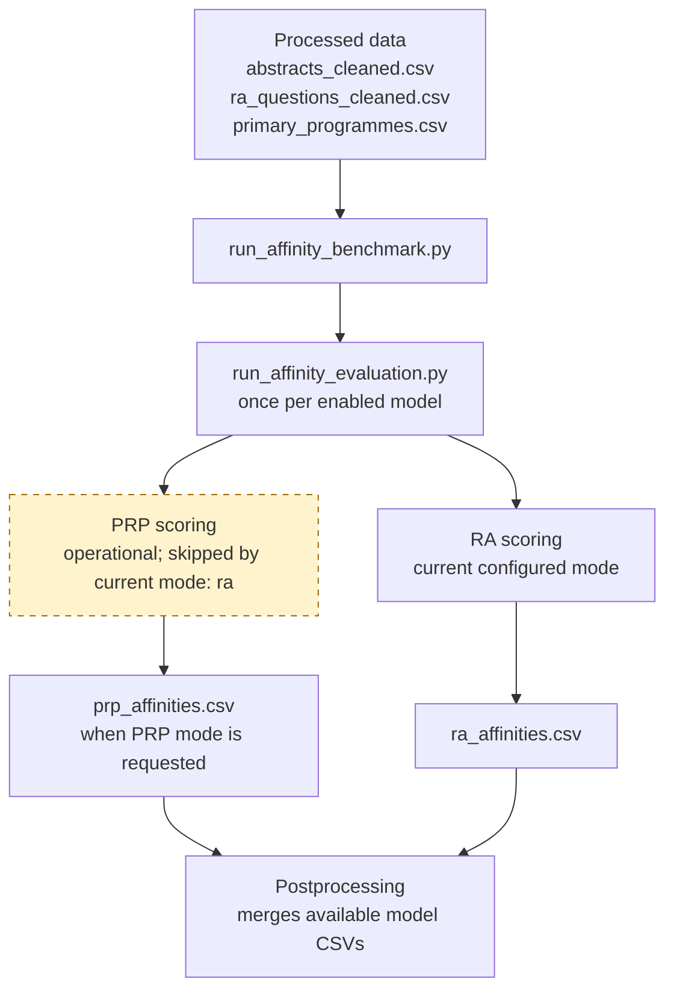

# Affinity Evaluation

The evaluator scores IEEE abstracts against Research Agenda (RA) questions,
Primary Research Programmes (PRPs), or both. It combines embedding-based RA
candidate retrieval with LLM affinity scoring and uses an LLM scope check when
scoring PRPs. Evaluation mode and retrieval defaults are set under
`runtime.affinity` in `src/config/settings.yaml`.

## Current Configuration

The active evaluator defaults from `runtime.affinity` in
`src/config/settings.yaml` are:

```yaml
runtime:
  affinity:
    mode: ra
    ra_retrieval_mode: cosine
    top_k: 48
    abstracts_file: abstracts_cleaned.csv
    prp_input: data/results/prp_affinities.csv
    prp_top_n: 6
    prp_min_affinity: null
    prp_membership_confidence_min: 10
    prp_scope_fallback_mode: legacy_scores
```

This selects RA evaluation with cosine retrieval by default. PRP scoring and
PRP-routed retrieval are available when selected for a run. Few-shot prompting,
affinity reasons, and score-scale versioning are shared with adjudication; see
the [Few-Shot Prompting and Affinity Scoring Scale
guide](few-shot-affinity-calibration.md).

## Where It Fits

`scripts/run_affinity_evaluation.py` evaluates one model/backend invocation.
`scripts/run_affinity_benchmark.py` orchestrates that evaluator once per
enabled model profile, isolates each model's results, and then postprocesses
the completed run. The benchmark's enabled profiles are listed under
`models.llm.benchmark.models` in `src/config/settings.yaml`.



> **Important:** `runtime.affinity.mode` is currently `ra`, so PRP scoring is
> implemented but not run by default. With benchmark `--mode both`, PRP scoring
> runs first for each model, then RA evaluation uses that model's PRP CSV for
> PRP-routed retrieval before postprocessing. To run PRP explicitly, set the
> mode to `prp` or `both`. See the
> [benchmark and adjudication workflow](../README.md#basic-benchmark-and-adjudication-workflow)
> for how those outputs connect to adjudication. This setting is in
> `src/config/settings.yaml`.

## Inputs

The evaluator reads all three processed files from `data/processed/`, even when
only one stage is requested. The directory and default abstract filename are
set by `paths.data_processed` and `runtime.affinity.abstracts_file` in
`src/config/settings.yaml`:

| File | Required data |
|---|---|
| `abstracts_cleaned.csv` | Abstract text in `Abstract_Cleaned`; optional publication year/journal fields support filtering |
| `ra_questions_cleaned.csv` | `RA2025` identifiers and `Question_Cleaned` text; primary and secondary PRP columns are used to route questions |
| `primary_programmes.csv` | PRP names and descriptions, including a `General` row/description used as the PRP scope anchor |

Use `--abstracts-file` to select a different cleaned abstract file; the option
overrides the default for benchmark runs. Rows marked
`Already_Classified` are skipped. Optional `--year-start`, `--year-end`, and
`--journals` filters restrict the abstracts by publication metadata; requested
filters fail if the corresponding source column is not present. The default
abstract filename is `runtime.affinity.abstracts_file` in
`src/config/settings.yaml`.

## Evaluation Stages

### PRP

For each abstract, the evaluator first asks the LLM whether the paper belongs
within the scope of any PRP and obtains a membership-confidence value. It then
scores the abstract against each named PRP in a batch. The `General` entry is
used only as a scope anchor; it is not written as a scored PRP target. Scope
behavior is controlled by `runtime.affinity.prp_membership_confidence_min` and
`runtime.affinity.prp_scope_fallback_mode` in `src/config/settings.yaml`.

CLI flags can override the scope threshold and parser fallback mode. If the scope result says
the abstract is out of scope, or membership confidence is below
`--prp-membership-confidence-min`, the PRP affinity scores are set to zero. The
default minimum confidence is `10`. If the scope response cannot be parsed,
`--prp-scope-fallback-mode legacy_scores` falls back to ordinary PRP scoring;
`strict` instead fails the run. The defaults are set under `runtime.affinity`
in `src/config/settings.yaml`.

### RA

The evaluator embeds the abstract and retrieves up
to `top_k` RA questions, then asks the LLM to score those candidates.
`Cosine_x100` records retrieval similarity; `LLM_Affinity` is the model's
affinity score, clamped to the range 0-120. When enabled,
`LLM_Affinity_Reason` contains the model's explanation. The default candidate
limit is `runtime.affinity.top_k` in `src/config/settings.yaml`.

`--ra-retrieval-mode` selects which subset of RA questions is considered for
each abstract; it overrides the default strategy for one run:

| Mode | Candidate selection |
|---|---|
| `cosine` | Ignore PRP results. Rank all RA questions by embedding cosine similarity and keep the top `top_k`. |
| `prp_filter` | Rank PRPs by affinity, keep the top `prp_top_n`, retain RA questions whose primary or secondary programme matches those PRPs, then keep up to `top_k` questions by cosine similarity within that subset. |
| `prp_only` | Use the same top-`prp_top_n` PRP-associated RA subset, then choose up to `top_k` questions by PRP rank without cosine ranking. |

The default strategy is set by `runtime.affinity.ra_retrieval_mode` in
`src/config/settings.yaml`.

The current `prp_top_n: 6` means at most the six highest-scoring positive-affinity PRPs per
abstract are used to choose associated RA questions; in current configuration, since `top_k: 48`, it **does** score all research questions. It only applies to `prp_filter` and `prp_only`,
so it has no effect while the current retrieval mode is `cosine`. Routing input,
top-N, and minimum-affinity values are set by `runtime.affinity.prp_input`,
`prp_top_n`, and `prp_min_affinity` in `src/config/settings.yaml`.

> **Important:** If no usable PRP route is available, RA candidate retrieval
> falls back to cosine similarity. In the benchmark wrapper, a missing
> per-model PRP file is replaced with an empty PRP scaffold when the processed
> abstracts and programme files exist; since it supplies no positive PRP
> routes, the evaluator falls back to cosine. A standalone
> `run_affinity_evaluation.py` call with a missing `--prp-input` instead raises
> `FileNotFoundError`. In either case, `cosine` mode always evaluates candidates
> independently of PRP results.

## Outputs

By default, standalone evaluation writes to `data/results/`; benchmark runs
override the output directory per model:

| Requested mode | Output |
|---|---|
| `prp` or `both` | `prp_affinities.csv` |
| `ra` or `both` | `ra_affinities.csv` |
| Any mode | `combined_affinities.xlsx`, with a sheet for each requested stage |

The standalone output root is set by `paths.results` in
`src/config/settings.yaml`.

The evaluator also writes `abstract_lookup_cleaned.csv` for downstream
adjudication and `run_metadata.json` with the mode, inputs, filters, and run
metadata. In a benchmark run, outputs instead go under
`data/results/affinity_benchmark/<run_id>/<model_slug>/`; the lookup is saved at
the run level so downstream steps can resolve abstracts consistently. The
selected stage files are determined by `runtime.affinity.mode` in
`src/config/settings.yaml`.

PRP CSV rows contain the abstract index and title,
PRP name and description, `LLM_Affinity`, and optional
`LLM_Affinity_Reason`. RA CSV rows contain the abstract index and title, RA
question ID and text, `Cosine_x100`, `LLM_Affinity`, and optional
`LLM_Affinity_Reason`; these schemas are written by
`scripts/run_affinity_evaluation.py`.

## Run It

### Benchmark (Recommended for Multiple Models)

The benchmark executes each enabled profile with its own model, backend,
credentials, and output directory. For `both`, it runs PRP first and uses the
per-model PRP file for RA routing. Enabled profiles are listed under
`models.llm.benchmark.models` in `src/config/settings.yaml`:

```bash
python scripts/run_affinity_benchmark.py \
  --mode both \
  --ra-retrieval-mode prp_only \
  --run-id example_run
```

The benchmark automatically postprocesses the per-model files when the run
finishes. Its output root comes from `paths.results` in
`src/config/settings.yaml` plus the run ID and model slug.

### Standalone PRP Evaluation

```bash
python scripts/run_affinity_evaluation.py --mode prp
```

### Standalone RA Evaluation

In `cosine` mode every abstract retrieves RA candidates
by similarity without a PRP result file:

```bash
python scripts/run_affinity_evaluation.py \
  --mode ra \
  --ra-retrieval-mode cosine
```

The default retrieval mode is `runtime.affinity.ra_retrieval_mode` in
`src/config/settings.yaml`; `--ra-retrieval-mode` overrides it for this run.

To use PRP-routed retrieval, first create a PRP file and then pass it to RA:

```bash
python scripts/run_affinity_evaluation.py --mode prp
python scripts/run_affinity_evaluation.py \
  --mode ra \
  --ra-retrieval-mode prp_only \
  --prp-input data/results/prp_affinities.csv \
  --prp-top-n 6
```

The standalone PRP-routing defaults are `runtime.affinity.prp_input` and
`runtime.affinity.prp_top_n` in `src/config/settings.yaml`.

### Standalone Both Stages

```bash
python scripts/run_affinity_evaluation.py --mode both --ra-retrieval-mode cosine
```

The standalone evaluator's loop evaluates RA before PRP.
Therefore, when using `--mode both` with `prp_filter` or `prp_only`,
`--prp-input` must already point to an existing PRP result file. For PRP-first,
per-model routing, use the benchmark command above.

## Useful Options

Useful per-run options include:

- `--mode both|prp|ra`
- `--ra-retrieval-mode cosine|prp_filter|prp_only`
- `--prp-input`, `--prp-top-n`, and `--prp-min-affinity`
- `--year-start`, `--year-end`, and `--journals`
- `--enable-few-shot` / `--no-enable-few-shot`
- `--enable-affinity-reasons` / `--no-enable-affinity-reasons`
- `--prp-membership-confidence-min` and `--prp-scope-fallback-mode strict|legacy_scores`

Model credentials and backend selection are described in
the [Setup Guide](setup.md).

## Model Configuration

Standalone affinity evaluation uses the shared LLM runtime profile. The
following is the relevant `models.llm` excerpt from
`src/config/settings.yaml`:

```yaml
models:
  llm:
    default_backend: cloud
    backend_env_var: LLM_BACKEND
    model_env_var: OPENAI_MODEL
    base_url_env_var: OPENAI_BASE_URL
    api_key_env_var: OPENAI_CLOUD_API_KEY
    rpm_env_var: OPENAI_REQUESTS_PER_MINUTE
    local:
      base_url: http://localhost:11434/v1
      api_key: ollama
      model: gemma4:31b-cloud
      requests_per_minute_default: 9999
    cloud:
      model: gpt-5.4
      base_url: null
      api_key_env: OPENAI_CLOUD_API_KEY
      requests_per_minute_default: 500
```

Configure provider credentials as described in the [Setup Guide](setup.md).
Keep API secrets in environment variables rather than in `settings.yaml`.

For standalone evaluation, environment variables override the active shared
profile:

| Environment variable | Overrides |
|---|---|
| `LLM_BACKEND` | `models.llm.default_backend` |
| `OPENAI_MODEL` | Active profile's `model` |
| `OPENAI_BASE_URL` | Active profile's `base_url` |
| `OPENAI_REQUESTS_PER_MINUTE` | Active profile's `requests_per_minute_default` |

The multi-model benchmark uses `models.llm.benchmark.models` instead of one
shared model for all evaluator calls. Each enabled profile can specify its own
backend, model, endpoint, credential-variable name, and request rate; the
benchmark passes those profile values to its per-model evaluator processes.
`AFFINITY_BENCHMARK_MODELS` selects an override list, and
`AFFINITY_BENCHMARK_BACKEND` can force its backend. The profiles and override
variable names are configured under `models.llm.benchmark` in
`src/config/settings.yaml`.

Shared few-shot examples, affinity reasons, and score-scale behavior are
configured under `runtime.llm_reasoner`; see the [Few-Shot Prompting and
Affinity Scoring Scale guide](few-shot-affinity-calibration.md) for the
canonical YAML settings and overrides.